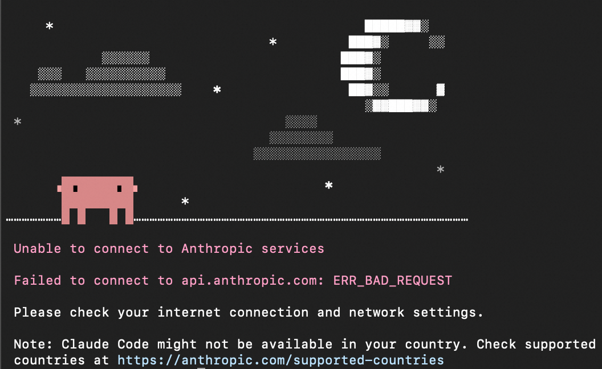

# Claude Code 安装配置

Claude Code 是 Anthropic 的智能编程工具，支持原生安装、Node 与 VS Code 插件。前置：Claude 账号（Pro/Max 或 API）、或其他大模型 API、4GB+ 内存。

---

## 一、有网络代理：推荐安装（原生）

| 系统   | 命令 |
|--------|------|
| macOS  | `curl -fsSL https://claude.ai/install.sh \| bash` 或 `brew install --cask claude-code` |
| Windows | 管理员 PowerShell：`irm https://claude.ai/install.ps1 \| iex` 或 `winget install Anthropic.ClaudeCode` |

安装后执行 `claude --version` 或 `claude doctor` 验证。

**国内网络**：脚本/brew/winget 可能超时。若本机已开代理（如 Clash），先设代理再安装。

- **方式 1**：Clash → General → Port → 复制端口号 → 打开终端粘贴并回车 → 再执行安装命令。
- **方式 2**：下面示例里 `127.0.0.1:7890` 表示「本机地址:端口」，请改成你实际代理的地址和端口（如 Clash 默认常为 7890）：
  - Mac/Linux：`export HTTP_PROXY=http://127.0.0.1:7890 HTTPS_PROXY=http://127.0.0.1:7890 ALL_PROXY=http://127.0.0.1:7890 NO_PROXY=localhost,127.0.0.1,::1`
  - Windows PowerShell：`$env:HTTP_PROXY="http://127.0.0.1:7890"; $env:HTTPS_PROXY=$env:HTTP_PROXY; $env:ALL_PROXY=$env:HTTP_PROXY; $env:NO_PROXY="localhost,127.0.0.1"`

代理需放行：`claude.ai`、`api.anthropic.com` 等。

---

## 二、Node 安装（不推荐，仅作备选）

官方已不推荐通过 Node 安装。若必须用 Node，先 `nvm use 20`（或当前 LTS），再任选一种包管理器全局安装：

| 包管理器 | 安装 | 卸载 |
|----------|------|------|
| npm  | `npm install -g @anthropic-ai/claude-code` | `npm uninstall -g @anthropic-ai/claude-code` |
| yarn | `yarn global add @anthropic-ai/claude-code` | `yarn global remove @anthropic-ai/claude-code` |
| pnpm | `pnpm add -g @anthropic-ai/claude-code`     | `pnpm remove -g @anthropic-ai/claude-code`   |

**nvm 注意**：全局安装会装到当前 nvm 选中的 Node；换版本后需在该版本下重装。确保 nvm 已写入 `~/.zshrc`/`~/.bashrc`（Mac）或 PATH（Windows）。

---

## 三、VS Code 插件

VS Code 内按 `Ctrl+Shift+X`（Mac：`Cmd+Shift+X`）→ 搜索「Claude Code」→ 安装 Anthropic 官方扩展。需 VS Code ≥ 1.98.0 及 Pro/Max 订阅或 API Key。

### 如何配置

1. **打开配置**：安装后在侧栏点击 Claude（Spark 图标）或右下角「✱ Claude Code」，或按 `Ctrl+Shift+P`（Mac：`Cmd+Shift+P`）搜索「Claude Code」→ 选择「Open in New Tab」等；首次使用会提示登录或配置 API Key。
2. **使用 Anthropic 账号**：按提示在浏览器中登录 Claude 账号（需网络可访问 anthropic.com）。
3. **使用 API Key 或国内大模型（推荐用 ~/.claude/settings.json）**：扩展与 CLI 共用同一套配置，官方推荐在 **`~/.claude/settings.json`**（Windows：`%USERPROFILE%\.claude\settings.json`）里用 **`env`** 配置，扩展和终端里的 `claude` 都会生效：
   ```json
   {
     "env": {
       "ANTHROPIC_API_KEY": "sk-ant-你的密钥"
     }
   }
   ```
   使用国内大模型（如阿里云百炼）时，需同时配置 Base URL 与模型，例如：
   ```json
   {
     "env": {
       "ANTHROPIC_BASE_URL": "https://dashscope.aliyuncs.com/apps/anthropic",
       "ANTHROPIC_API_KEY": "你的百炼 API Key",
       "ANTHROPIC_MODEL": "qwen3-coder-plus"
     }
   }
   ```
   详细步骤与模型列表见 [阿里云百炼：Claude Code](https://help.aliyun.com/zh/model-studio/claude-code#8ab558818fv3f)。
4. **仅扩展内生效：VS Code 设置**：打开 VS Code 设置（`Ctrl+,` / `Cmd+,`）→ 扩展 → Claude Code，找到 **Environment Variables**，或在「打开设置(JSON)」里添加（键名为 **`claudeCode.environmentVariables`**）：
   ```json
   "claudeCode.environmentVariables": [
     { "name": "ANTHROPIC_API_KEY", "value": "sk-ant-xxx" }
   ]
   ```
   使用国内大模型时同样可在此配置 `ANTHROPIC_BASE_URL`、`ANTHROPIC_API_KEY`、`ANTHROPIC_MODEL`。若无法登录，可勾选 **Disable Login Prompt**（跳过登录提示）。

配置后重启 VS Code 或执行「Developer: Reload Window」使配置生效。

---

## 四、登录与 API Key（跳过浏览器登录）

初次使用 Claude Code 时，可能会强制要求登录 Anthropic 账户。请按以下步骤操作以跳过该流程（步骤与图示详见 [阿里云百炼：Claude Code](https://help.aliyun.com/zh/model-studio/claude-code#8ab558818fv3f)）。

若出现无法连接 Anthropic 服务的提示（如 `Failed to connect to api.anthropic.com: ERR_BAD_REQUEST`），可先按下面步骤配置 `.claude.json` 跳过登录，或改用国内大模型 API（如阿里云百炼）并配置对应 Base URL 与 API Key。



1. **找到用户主目录下的 `.claude.json` 文件**
   - macOS / Linux：`~/.claude.json`
   - Windows：`C:\Users\%USERNAME%\.claude.json`  
   （若不存在可新建该文件。）

2. **将 `hasCompletedOnboarding` 设为 `true`**，保存文件：
   ```json
   {
     "hasCompletedOnboarding": true
   }
   ```

3. **新开一个终端**，再执行 `claude`，即可跳过浏览器登录流程。

---

**改用 API Key（按量计费、不依赖浏览器）**：具体参考所使用的大模型官方文档，例如 [阿里云百炼：Claude Code](https://help.aliyun.com/zh/model-studio/claude-code#8ab558818fv3f)。

**常用命令**：`claude`、`claude "解释这个项目"`、`claude -p "问题"`。
