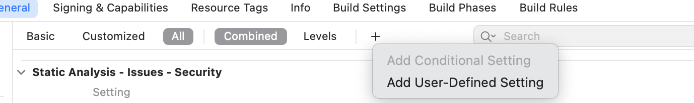
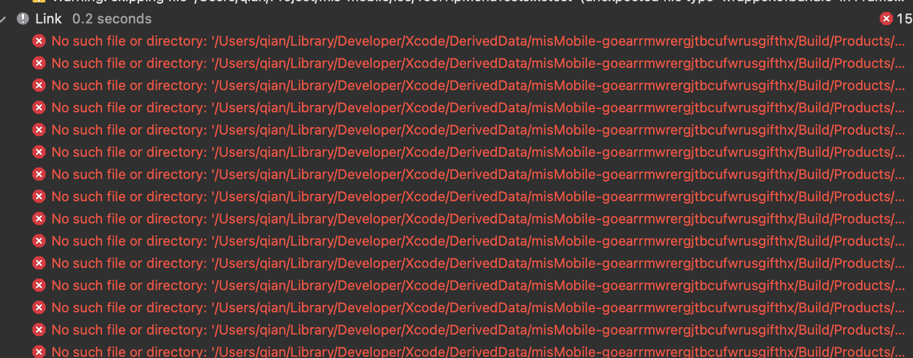
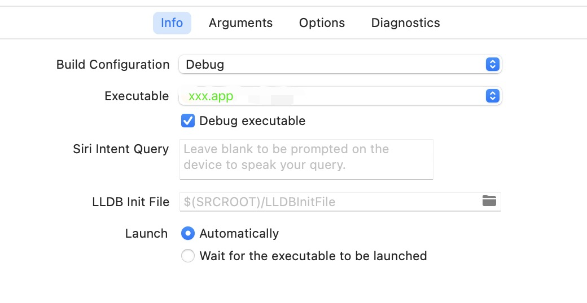

# Mac m1 运行 xcode13 常见问题及解决(20230201)
 
## 一、背景

近期入职了新公司，祖传 RN 项目 0.59版本，依赖库版本低；同事建议使用 Xcode13 版本运行，但是该版本不支持 Mac M1+ 芯片，导致 Xcode 跑不起来项目，影响 ios 开发联调。

## 二、解决

- Mac m1 芯片，需要使用 Rosetta 方式 启动Xcode 13.3。
  操作步骤：
  Go to finder -> Applications -> Xcode -> Right click on Xcode -> Select open using rosetta
  以下操作路径：【系统：macOS Monterey 芯片：Apple M1 Pro】
  访达 -> 应用程序 -> Xcode -> 鼠标右键 -> 显示简介 -> 通用 -> 使用 Rosetta 打开

- 一般会遇到这个错误
  building for iOS Simulator, but linking in object file built for iOS, for architecture arm64
  解决方案：
  1).  在Podfile中增加代码
  ```sh
  post_install do |installer|
    installer.pods_project.build_configurations.each do |config|
      config.build_settings["EXCLUDED_ARCHS[sdk=iphonesimulator*]"] = "arm64"
    end
  end
  ```
  2). 增加User-Defined配置 

  

  3) 配置Excluded Architectures ‘arm64’
  4) clear项目，重启xCode

- link库抛红
  
  

  解决方案：
  在 Build Phases -> Dependencies 中将抛红的库都加进去

- 调试模式启动时记得将Scheme改为Debug
  
  


## 三、配置Scheme
/xxx/ios/xxx.xcodeproj/xcshareddata/xcschemes/xxx.xcscheme
```xml
<?xml version="1.0" encoding="UTF-8"?>
<Scheme
   LastUpgradeVersion = "0940"
   version = "1.3">
   <BuildAction
      parallelizeBuildables = "NO"
      buildImplicitDependencies = "YES">
      <BuildActionEntries>
         <BuildActionEntry
            buildForTesting = "YES"
            buildForRunning = "YES"
            buildForProfiling = "YES"
            buildForArchiving = "YES"
            buildForAnalyzing = "YES">
            <BuildableReference
               BuildableIdentifier = "primary"
               BlueprintIdentifier = "83CBBA2D1A601D0E00E9B192"
               BuildableName = "libReact.a"
               BlueprintName = "React"
               ReferencedContainer = "container:../node_modules/react-native/React/React.xcodeproj">
            </BuildableReference>
         </BuildActionEntry>
         <BuildActionEntry
            buildForTesting = "YES"
            buildForRunning = "YES"
            buildForProfiling = "YES"
            buildForArchiving = "YES"
            buildForAnalyzing = "YES">
            <BuildableReference
               BuildableIdentifier = "primary"
               BlueprintIdentifier = "13B07F861A680F5B00A75B9A"
               BuildableName = "xxxxxxx.app"
               BlueprintName = "xxxxxxx"
               ReferencedContainer = "container:xxxxxxx.xcodeproj">
            </BuildableReference>
         </BuildActionEntry>
         <BuildActionEntry
            buildForTesting = "YES"
            buildForRunning = "YES"
            buildForProfiling = "NO"
            buildForArchiving = "NO"
            buildForAnalyzing = "YES">
            <BuildableReference
               BuildableIdentifier = "primary"
               BlueprintIdentifier = "00E356ED1AD99517003FC87E"
               BuildableName = "xxxxxxxTests.xctest"
               BlueprintName = "xxxxxxxTests"
               ReferencedContainer = "container:xxxxxxx.xcodeproj">
            </BuildableReference>
         </BuildActionEntry>
      </BuildActionEntries>
   </BuildAction>
   <TestAction
      buildConfiguration = "Debug"
      selectedDebuggerIdentifier = "Xcode.DebuggerFoundation.Debugger.LLDB"
      selectedLauncherIdentifier = "Xcode.DebuggerFoundation.Launcher.LLDB"
      shouldUseLaunchSchemeArgsEnv = "YES">
      <MacroExpansion>
         <BuildableReference
            BuildableIdentifier = "primary"
            BlueprintIdentifier = "13B07F861A680F5B00A75B9A"
            BuildableName = "xxxxxxx.app"
            BlueprintName = "xxxxxxx"
            ReferencedContainer = "container:xxxxxxx.xcodeproj">
         </BuildableReference>
      </MacroExpansion>
      <Testables>
         <TestableReference
            skipped = "NO">
            <BuildableReference
               BuildableIdentifier = "primary"
               BlueprintIdentifier = "00E356ED1AD99517003FC87E"
               BuildableName = "xxxxxxxTests.xctest"
               BlueprintName = "xxxxxxxTests"
               ReferencedContainer = "container:xxxxxxx.xcodeproj">
            </BuildableReference>
         </TestableReference>
      </Testables>
   </TestAction>
   <LaunchAction
      buildConfiguration = "Debug"
      selectedDebuggerIdentifier = "Xcode.DebuggerFoundation.Debugger.LLDB"
      selectedLauncherIdentifier = "Xcode.DebuggerFoundation.Launcher.LLDB"
      launchStyle = "0"
      useCustomWorkingDirectory = "NO"
      ignoresPersistentStateOnLaunch = "NO"
      debugDocumentVersioning = "YES"
      debugServiceExtension = "internal"
      allowLocationSimulation = "YES">
      <BuildableProductRunnable
         runnableDebuggingMode = "0">
         <BuildableReference
            BuildableIdentifier = "primary"
            BlueprintIdentifier = "13B07F861A680F5B00A75B9A"
            BuildableName = "xxxxxxx.app"
            BlueprintName = "xxxxxxx"
            ReferencedContainer = "container:xxxxxxx.xcodeproj">
         </BuildableReference>
      </BuildableProductRunnable>
      <EnvironmentVariables>
         <EnvironmentVariable
            key = "OS_ACTIVITY_MODE"
            value = "disable"
            isEnabled = "YES">
         </EnvironmentVariable>
      </EnvironmentVariables>
   </LaunchAction>
   <ProfileAction
      buildConfiguration = "Debug"
      shouldUseLaunchSchemeArgsEnv = "YES"
      savedToolIdentifier = ""
      useCustomWorkingDirectory = "NO"
      debugDocumentVersioning = "YES">
      <BuildableProductRunnable
         runnableDebuggingMode = "0">
         <BuildableReference
            BuildableIdentifier = "primary"
            BlueprintIdentifier = "13B07F861A680F5B00A75B9A"
            BuildableName = "xxxxxxx.app"
            BlueprintName = "xxxxxxx"
            ReferencedContainer = "container:xxxxxxx.xcodeproj">
         </BuildableReference>
      </BuildableProductRunnable>
   </ProfileAction>
   <AnalyzeAction
      buildConfiguration = "Debug">
   </AnalyzeAction>
   <ArchiveAction
      buildConfiguration = "Release"
      revealArchiveInOrganizer = "YES">
   </ArchiveAction>
</Scheme>
```
```sh
VALID_ARCHS = "arm64 armv7 armv7s x86_64";
```


## 四、m1打包失败解决
> (按照此配置打包能成功，但是包不可用于生产)

1.项目根目录命令行执行，等大约2分钟
```shell
react-native bundle --entry-file index.js --bundle-output ./ios/main.jsbundle --platform ios --assets-dest ./ios --dev false 
```
2  Xcode ==> xxxxxxx项目 ==> TARGETS ==> Build Phases ==> Copy Bundle Resources ==> 点击下方添加 ==> 输入 main.jsbundle ==> 选中点 Add
3  重新构建 Xcode ==> Product ==> Archive

## 五、参考
https://stackoverflow.com/questions/63607158/xcode-building-for-ios-simulator-but-linking-in-an-object-file-built-for-ios-f/63955114#63955114
