# 前端开箱-Harmony OS

## 缘起：万物互联、遥遥领先。

### HarmonyOS 第一课 [传送门](https://developer.harmonyos.com/cn/documentation/teaching-video/) 官方详细视频讲解[创新实训营：DevEco开发套件特性介绍](https://developer.huawei.com/consumer/cn/training/course/video/C101705022216253130)
> 跟着第一课开卷

#### 一、下载开发套件 DevEco Studio
+ 访问 [HUAWEI DevEco Studio](https://developer.huawei.com/consumer/cn/deveco-studio/) 选择系统 版本下载

#### 二、Mac 安装
> 需要 Node环境

  1. 解压安装包，双击 deveco-studio-3.1.0.501-aarch64.dmg 文件
  2. 安装后在【启动台】打开，按照指引安装 SDK。
  3. 安装 本地预览SDK。
  + 打开EevEco 左下角 Configure -> Plugins 选择 SDK --> 勾选 System-image-phone --> 点击右下角 Apply 
  
  + 点击 Tools --> 勾选 Emulator --> 右下角 Apply。
  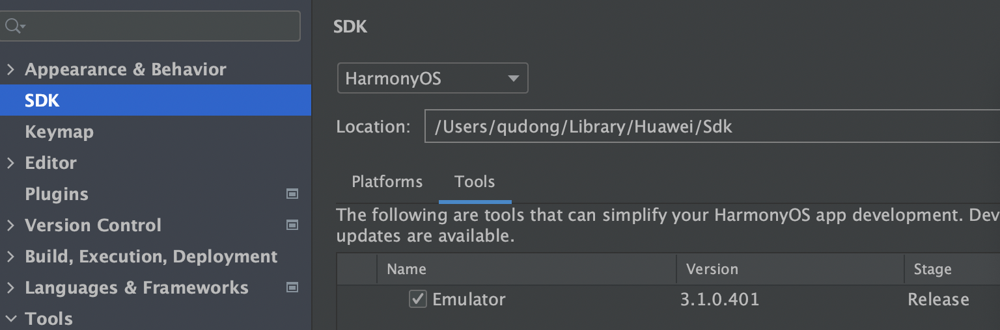
 

#### 三、创建示例项目
> Hello Harmony!

1. 打开EevEco --> Create Project
  
2. 设置项目基本信息
  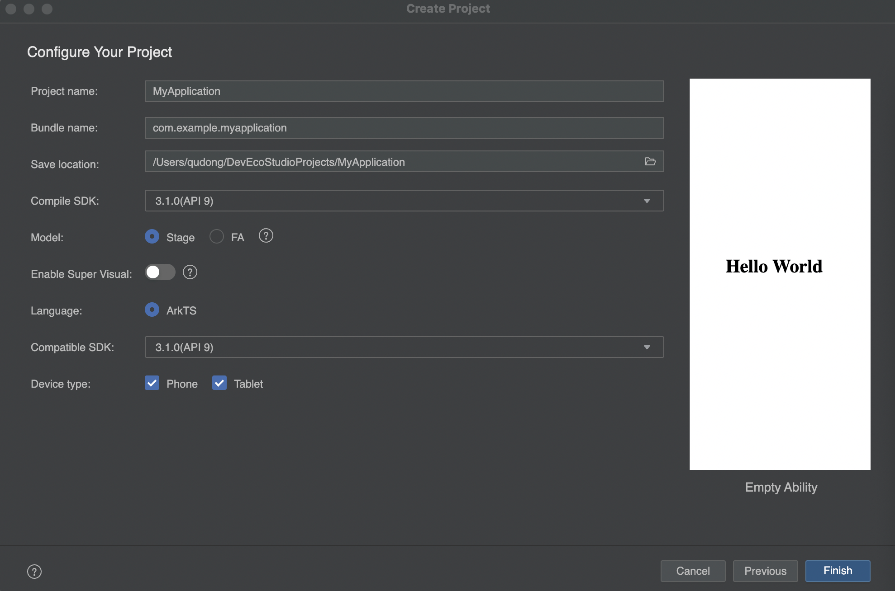
3. 项目基本目录
  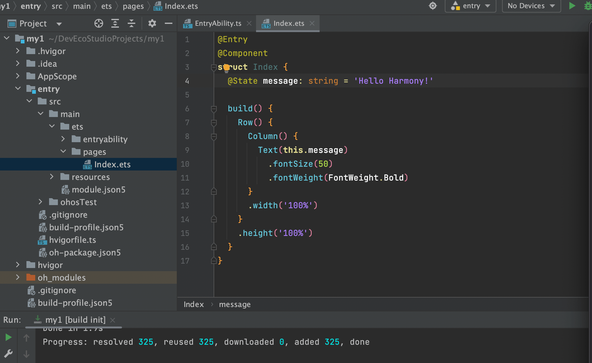
  第一次看到代码的我，惊呼一声 “好家伙！” 果然是 ArkTS，好眼熟哇。

4. 把 Hello World 修改为 Hello Harmony!，点击运行【绿色三角】。
   发现：
  
  原因没有添加设备
   
5. 点击添加设备按钮
  
6. 点击右下角添加设备 【Tips: 第一次安装，需要先指定 Location 点击 Edit 选择目录即可】
  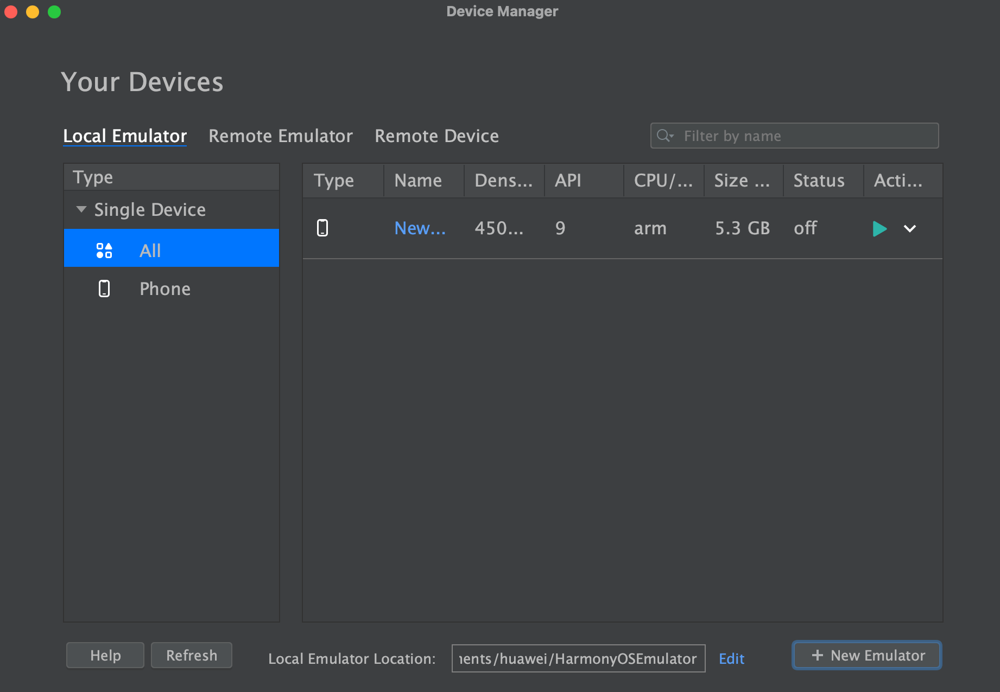

7. 设置后点击设备后 运行按钮
  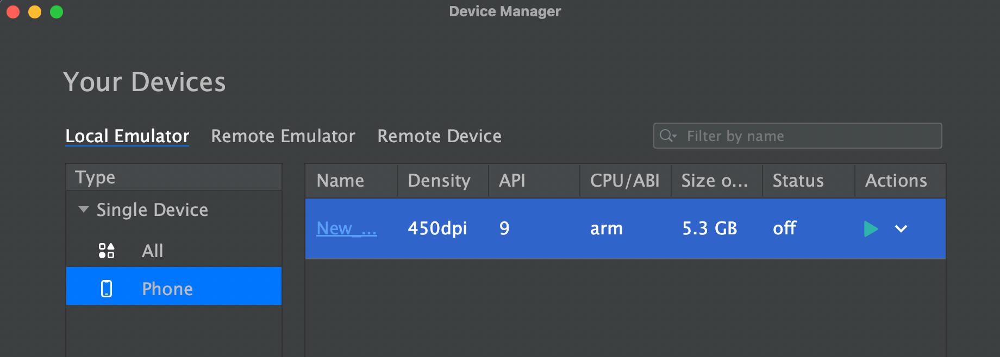
8. 属于你的遥遥领先：
   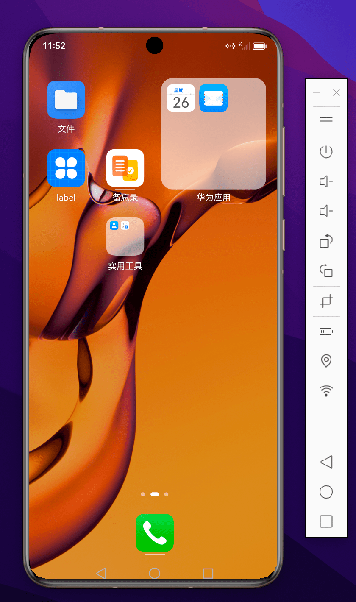
9. 再次运行程序
   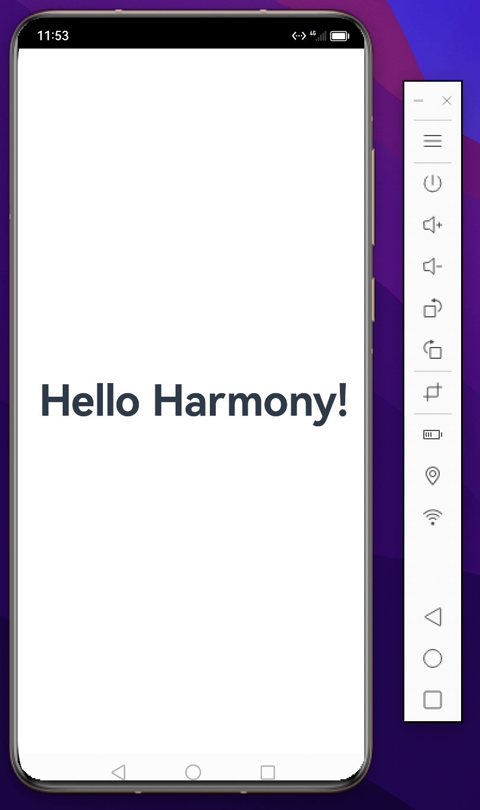

刚开始接触，开发体验很顺畅，基本无坑。后面先从基础开始。

#### 彩蛋：
> 痛：每次修改代码->保存-->重新run,略费手，且虚拟器占用内存较大配置低的 win 电脑可能吃不消。

> 问题：能不能像web开发体验一样，实时预览？

##### 当然可以！！！
1. 
   

    

      点击右侧 Previewer开启预览
      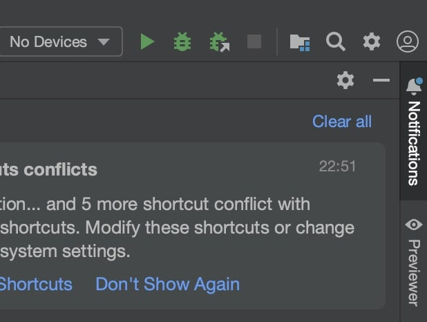 
    

    

      修改代码 command + s 保存，实时预览。
      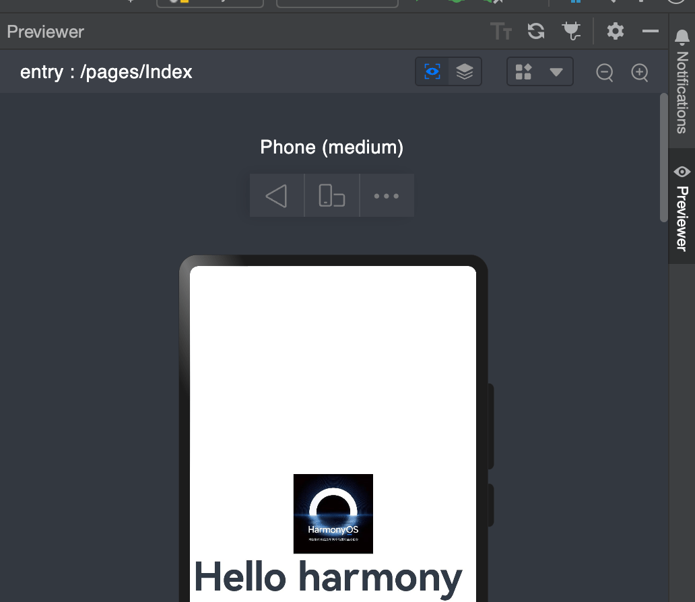
    

   

   
2. 多终端预览。
  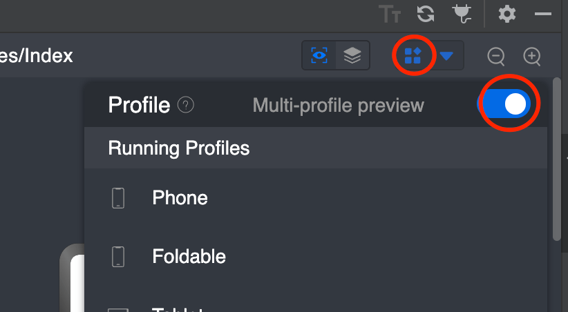 
  
1. 开启自动保存代码
   > 进入 Configure --> Preferences --> Appearance & Behavior
   > 点击 System-Settings
   > 勾选 Save files if the IDE is idle for 15 seconds
   > 表示IDE空闲15秒即自动保存文件，可自行修改空闲保存时长，自动保存后预览器实时预览
  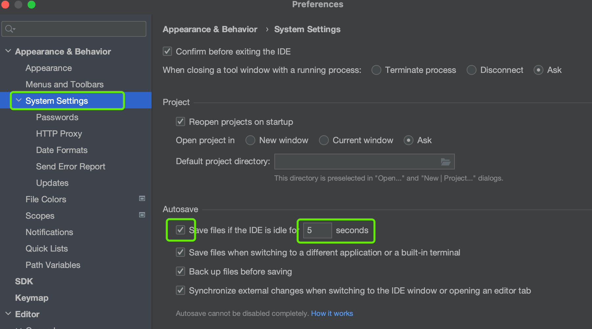 
   
