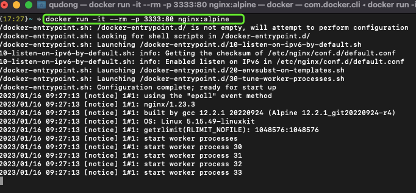
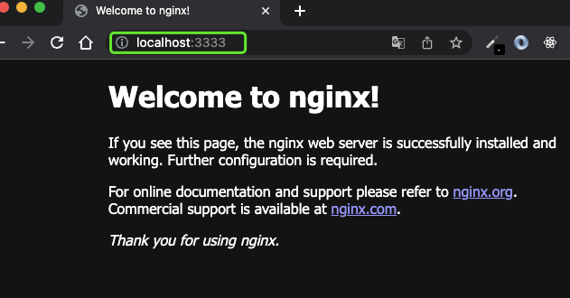
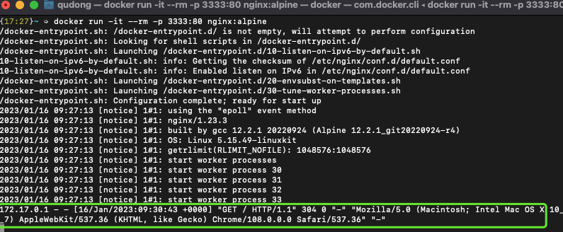
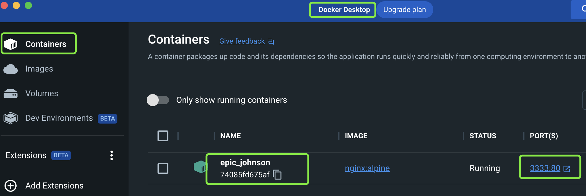
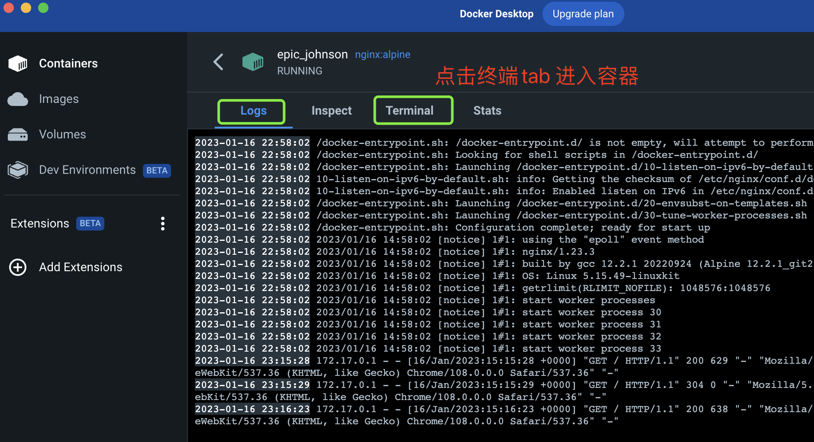
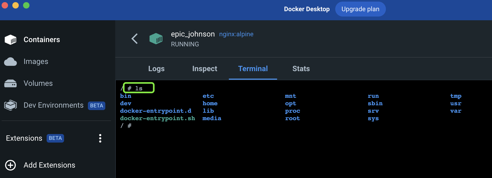
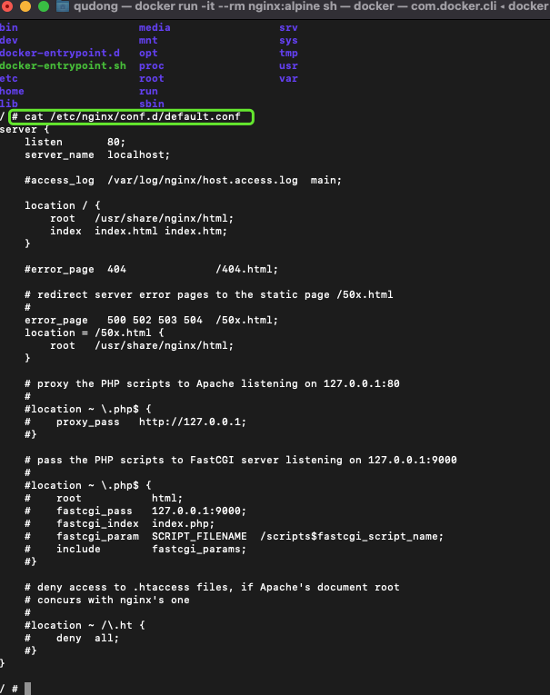
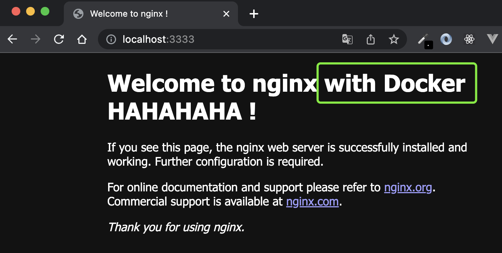

# 通过 Docker 学习 Nginx 
 
## 1. 缘起
记得当年在传智学习的时候，老师一步步苦口婆心教使用 Apache，后来工作关系学习了一丢丢 NG。最近在看【山月大佬的文章】[基于NG镜像部署及学习NG镜像]('https://q.shanyue.tech/deploy/simple-nginx.html#nginx-%E9%95%9C%E5%83%8F')，觉得很有意思记录一下。


## 2. Docker中 运行 NG 镜像。

2.1 安装 Docker 并打开。[下载]('https://www.docker.com/get-started/'') 后安装即可。

2.2 终端运行 NG 镜像

```sh
# 终端：docker 运行 NG镜像 指定容器端口映射到本地 3333.
docker run -it --rm -p 3333:80 nginx:alpine
# 提示：第一次会自动下载镜像
```


2.3 浏览器访问 http://localhost:3333/  
对这就跑起来了。同时同时终端打印以下日志。

浏览器页面：



终端日志：



## 3. 熟悉 NG 配置

3.1 进入 NG 容器

方法一：打开 Docker Desktop --> Containers --> 点击要查看的容器 --> Terminal





方法二：终端命令
```sh
# 【新开终端
# 查看所有运行容器

docker ps -a    

# 进入已运行的容器
# 终端：zsh 
# docker exec -it 容器id sh  
docker exec -it 74085fd675af sh   

# 终端：bash
# docker exec -it 74085fd675af bash

```


3.2 查看 NG 默认配置

默认配置文件位于 /etc/nginx/conf.d/default.conf
```sh
# 执行：
cat /etc/nginx/conf.d/default.conf
```


3.3 查看并编辑 NG 默认页面

```sh
# 执行：
vi /usr/share/nginx/html/index.html
# 编辑后页面响应变更
```


## 4：NG 配置
