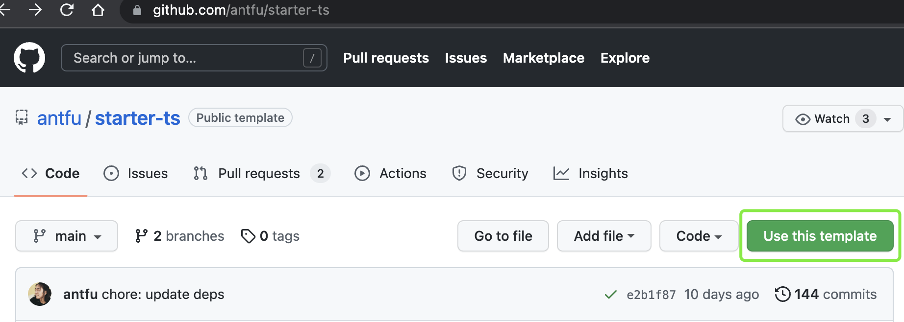
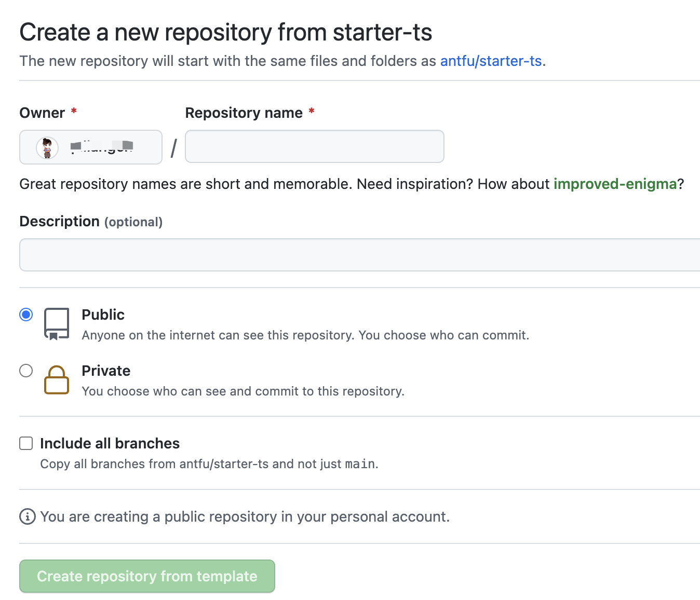
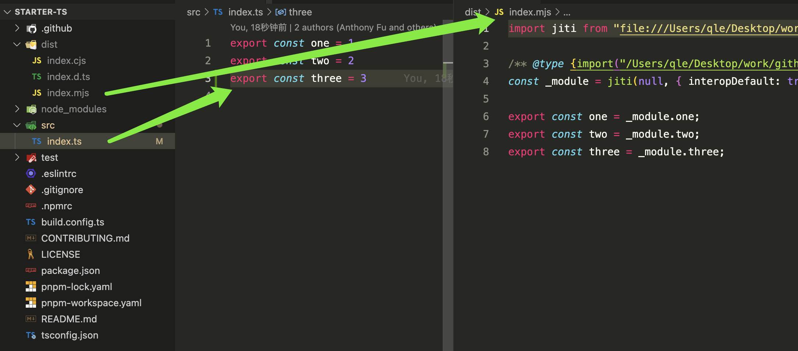

# 如何开发 NPM 包 ？ 

  如何开发npm包 ？
  
  我第一次开发 NPM 包时， CSDN、掘金、思否、知乎、简书，搜到很多文章，选了一些觉得靠谱的文章就开干了，殊不知工程化之旅就此展开。
  
  完整流程包括：初始化项目 => 工程化配置 => 开发功能 => 调试 => 测试 => 发布。
  
  实际开发过程中，把每个环节涉及的知识都了解清楚，还是非常耗费时间精力的。当时项目时间充裕，就一步步搞下来，也确实学到很多知识。当然这篇文章并不会讲解这些细节的。讲什么呢？

  如果把这个问题本身看做一个需求，核心是开发一个包，包相关的工程化是纯技术需求。
  
  对于没有相关基建沉淀的团队/个人建议这么做：
  - 使用优秀开源起手项目模板，优先支持核心需求开发
  - 完成业务需求后，再深入学习起手项目相关工程化配置

  推荐：起手项目
  - ⭐️⭐️⭐️ [@antfu/starter-ts](https://github.com/antfu/starter-ts)


  ## 具体步骤
   ### 一. 初始化项目
   1. 如果是 github 项目
   - 点击起手项目 github 首页 `Use this template` 按钮
     
   
   - 填写项目信息，创建项目仓库
     

   - clone 创建的项目到本地
  ```shell
    git clone git@github.com:xxx/starter-ts.git
    # 修改项目相关信息并提交
  ```

   2. 如果是私有 Gitlab 项目
   - clone 模板到本地
  ```shell
    git clone git@github.com:antfu/starter-ts.git
  ```

   - 修改项目相关信息并提交 commit
  
   - Gitlab 新建仓库 xxx/xxx.git
  
   - 提交代码到 Gitlab 仓库
  ```shell
    # 切换 git remote 为私有repo地址
    git remote set-url origin xxx/xxx.git
    # 新仓库一般为空
    git push -f
  ```
   ### 二. 项目启动、开发

  ```shell
    # 安装依赖
    pnpm i

    # src/index.ts 新增一行代码 export const three = 3

    # 构建dev 构建结果如下图 dist/*
    pnpm dev
  ```
  
  
  ### 三、调试
  1. 启动项目
  ```shell
    pnpm dev
  ```
  2. 包链接到全局(npm / yarn 方式相同)
  ```shell
    # 包项目执行
    yarn link
    # 输出
    # success Registered "pkg".
    # info You can now run `yarn link "pkg"` in the projects where you want to use this package and it will be used instead.
    # ✨  Done in 0.03s.
  ```
  3. 业务项目中 链接全局包
  ```shell
    yarn link pkg
  ```
  4. 修改 src/index.ts 代码，验证步骤 2 的项目是否更新。未更新重启 2 项目重试。
  5. 删除 link
  ```shell
    # 包项目中删除全局链接
    yarn unlink

    # 进入依赖项目
    yarn unlink pkg
    # tips: 删除链接后建议重装项目依赖
  ```
